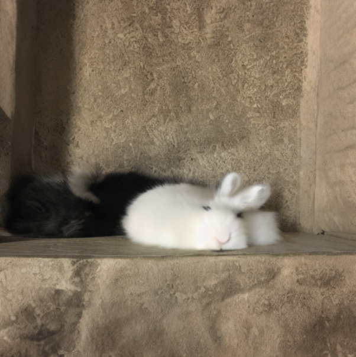

# Generative AI: Empowering Creatives with Specialized Image and Language Models

I'll cut to the chase. Generative AI is cool, but no, I don't think it's going destroy humanity.

I wanted to find some interesting applications of generative AI for my independent study in Cognitive Science @ Dartmouth College. Formally, my focus  area is "How can understanding the brain help us build better tools?" I have learned that Generative AI is a powerful application of brain-based software that affords incredible opportunities for creating tools that improve the human experience. Whether it's neurons or nodes, the emergent properties resulting from millions of finetuned dials never ceases to amaze me.

## Table of Contents

1. [Outputs](#outputs)  
1-1. [Text-Guided Image-to-Image Generation for Modern Architecture Design](##text-guided-image-to-image-generation-for-modern-architecture-design)  
1-2. [Masked Language Models for Personalized Autocompletion](##masked-language-models-for-personalized-autocompletion)  
2. [Training](#training)  
2-1. [Data](###data)  
2.2. [Models](###models)  
2-3. [Computing](###computing)  
2-4. [Scripts](###scripts)
3. [Intermediary Models](#intermediary-models)  
3-1. [Dreambooth Unconditional Pet Diffusion](###dreambooth-unconditional-pet-diffusion)  
3-2. [Stable Diffusion Unconditional Church Generation](###stable-diffusion-unconditional-church-generation)  
3-3. [Naive Chatbot Trained on Text Message Data](###naive-chatbot-trained-on-text-message-data)  
5. [Works Cited](#works-cited)  
6. [Acknowledgements](#acknowledgements)
7. [Next Steps](#next-steps)  

# Outputs

My best findings comprise the following tools. I cast a wide net into the pool of generative AI and only pursued what I perceived to be the most promising routes. Generative image and language tools have seen remarkable growth over the past couple years and are now open-source, generalizable, and customizable. Check out what I was able to create below.

## Text-Guided Image-to-Image Generation for Modern Architecture Design

    
    

    <em>Prompt = "modern house with a spacious home office, featuring large windows, a sleek desk setup, and plenty of natural light to inspire productivity"</em>

This text-guided image-to-image model takes as input a prompt and an image and returns an ammended version of the image based on the prompt. The model is built on top of [Stable Diffusion 2-1](https://huggingface.co/stabilityai/stable-diffusion-2-1-base) and finetuned for 75 epochs on a [custom web-scraped modern architecture dataset](https://huggingface.co/datasets/benlehrburger/modern-architecture). My vision for this model was to serve as the foundations of a tool to assist architects and designers in thinking outside of any box they may be confined to.

    
    

    <em>Prompt = "office building designed for sustainability, incorporating features like solar panels, rainwater harvesting systems, and efficient insulation to minimize environmental impact"</em>

To be a fully deployable tool, the model should be further finetuned on organic architecture (think [Zaha Hadid](https://www.zaha-hadid.com/)). Right now it produces a lot of "classically" modern results that are not as outlandish as the [Parametricism Era](https://en.wikipedia.org/wiki/Parametricism) of architecture – based on CAD modeling and algorithmic design – permits. It also suffers from the classic image generation pitfall of warping and bending reality when you take a closer look. However, it is an interesting first step towards new architectural possibilities.

    
    

    <em>Prompt = "modern church that pays homage to its religious symbolism through carefully crafted contemporary stained glass windows, capturing the play of light and color"</em>

Yes, those prompts were generated with ChatGPT. I'm really leaning into this whole thing.

## Masked Language Models for Personalized Autocompletion

I trained a masked language model to autocomplete my next word based on my undergraduate writings. The vision is something like a personalized Grammarly but with control over your data. I compiled a [training corpus](https://huggingface.co/datasets/benlehrburger/college-text-corpus) of over 3000 lines of writing samples from essays I had written during my time in college, which I used to finetune [DistilBERT](https://huggingface.co/distilbert-base-uncased) for 50 epochs. The "masked" in masked language model represents the word to be predicted, like so:

>Cognitive [MASK] >>> cognitive neuroscience

The model does well at predicting words in a coherent way.

>I'm looking for [MASK] >>> i'm looking for answers  
>I believe in [MASK] >>> i believe in truth

But it doesn't exactly understand who I am.

>I go to school in [MASK] >>> i go to school in bangkok  
>Ben [MASK] >>> ben!

I think if I were to give the tool more of a capacity for "long-term memory" moving forwards and consistently train it, it would really start to become a helpful, personalized writing aide. But right now it's just kind of weirdly pessimistic:

>One day we will [MASK] >>> one day we will die

# Training

### Data

  • [Modern Architecture](https://huggingface.co/datasets/benlehrburger/modern-architecture)  
  • [College Text Corpus](https://huggingface.co/datasets/benlehrburger/college-text-corpus)  

### Models

  • [Generative Architecture](./Models/ImageGeneration)  
  • [Masked Language Model](./Models/LanguageModels/AutoComplete)  

### Computing

I ran most of my computations on Dartmouth's [Discovery Cluster](https://rc.dartmouth.edu/index.php/discovery-overview/) GPUs, in conjunction with [Dartmouth Research Computing](https://rc.dartmouth.edu/). The remote cluster drastically sped up training and feed-forward runs, by about 10^2 the speed my CPU was running at. Special thank you to Kunal Jha, a D'24 ML wizard, who helped me get set up with the cluster. I intend to add my documentation notes to this repository in coming weeks (which I found to be very helpful). Dartmouth alum Jin Hyun Cheong also wrote a detailed [documentation](https://jinhyuncheong.com/jekyll/update/2016/07/24/How-to-use-the-Discovery-cluster.html) that I would recommend.

### Scripts

  • [Train Generative Architecture](./Scripts/Train/archGenDepth.py)  
  • [Train Autocomplete](./Scripts/Train/archGenDepth.py)  
  • [Feed-Forward Architecture](./Scripts/FeedForward/forwardNPaint.py)  
  • [Feed-Forward Autocomplete](./Scripts/FeedForward/forwardComplete.py)  

# Intermediary Models

### Dreambooth Unconditional Pet Diffusion

    
    

    <em>Prompt = "Nala the bunny on the beach"</em>

This [model](./Models/ImageGeneration/DreamBooth) was made using Dreambooth, which is a technique to teach new concepts to Stable Diffusion with very little training data. My [dataset](https://huggingface.co/datasets/benlehrburger/dreambooth-animal) for this model consists of just 17 images of my pet bunny, Nala. While she may seem slightly demented is those generated images above, it's actually not that far off from what she actually looks like:

    
    

This technique was fun because it's a lot of bang for your buck. Five minutes to create a dataset, 2 minutes on a GPU, and it's ready to go. That said, it certainly didn't work all of the time. Just look at the difference in these two samples generated from the same batch:

    
    

    <em>Prompt = "Nala the bunny at the Acropolis"</em>

### Stable Diffusion Unconditional Church Generation

On my way toward a text-guided image-to-image model, I first tried [unconditional architecture generation](./Models/ImageGeneration/GenerativeArchitecture). I began with the [LSUN Church Generative Model](https://www.yf.io/p/lsun) as a starting point, which generates low-res images of churches. I didn't want my model to have to learn image construction from scratch and this model appeared a good canvas to build on top of. I then finetuned the church-generating model on my [modern architecture dataset](https://huggingface.co/datasets/benlehrburger/modern-architecture) for varying amounts of depth, and found that the model reached a peak loss around 50 epochs of finetuning.

    
    

    <em>Prompt = "Original LSUN Church Image vs. Modern Finetuned Generated Image"</em>

This model was not nearly as powerful as the others, as you can tell by the low resolution and fuzzy edges. Sometimes when you work on this stuff for too long at a time you start to envision outputs that aren't really there. For instance, the following images were some of the model's better outputs, but it's clear that there is just not enough potency in my dataset to bridge the gap from churches to modern architecture.

    
    

    <em>Prompt = "Modern Finetuned Generated Image Samples"</em>

### Naive Chatbot Trained on Text Message Data

This [naive chatbot](https://github.com/benlehrburger/Independent-Study/blob/main/Models/LanguageModels/NaiveChatbot/Naive%20Chatbot.ipynb) was a stepping stone on my way to some sort of a custom large language model, which ended up becoming the aforementioned autocompletion tool. For a dataset, I downloaded my entire iPhone text history (which I did not publish online for obvious reasons) and isolated only messages I had sent. I then trained a chatbot from Python's Chatterbot library, but the chatbot was far too sensitive to my training data, which was also garbage. It turns out I am a gramatically terrible texter. Here are some of the dialogues between the chatbot and I:

>Me: Hello  
>Text-me: hello Joey  
<em>Joe (Joey) is a good friend.</em>  
>Me: How are you?  
>Text-me: tired  
<em>Sounds like me.</em>  
>Me: What are you doing tonight?  
>Text-me: where did you find it  
><em>It really knows how to kill a good conversation.</em>  

# Works Cited

Prior to this project, most of my work in the AI space had been with classifiers and prediction-making – not generative technologies. So, I spent the first four weeks of study project dipping my toes in different areas of AI. I followed many tutorials and read many papers, but the following resources are what really helped me solidify my foundations. I would highly recommend these series to anyone interested in the technologies I've presented above.

  • [Neural Networks: Zero to Hero](https://karpathy.ai/zero-to-hero.html) (Andrej Karpathy)  
  • [Hugging Face Diffusion Models Course](https://github.com/huggingface/diffusion-models-class)  

I also kept a bibliography throughout the project of papers I referenced and built upon. That list is attached below:

  • [JMLR Paper: Bengio et al. - A Neural Probabilistic Language Model](https://www.jmlr.org/papers/volume3/bengio03a/bengio03a.pdf)  
  • [arXiv: Adversarial Autoencoders](https://arxiv.org/abs/2303.12712)  
  • [ICCV Paper: He et al. - Delving Deep into Rectifiers](https://www.cv-foundation.org/openaccess/content_iccv_2015/papers/He_Delving_Deep_into_ICCV_2015_paper.pdf)  
  • [arXiv: Vinyals et al. - Show and Tell: A Neural Image Caption Generator](https://arxiv.org/abs/1502.03167)  
  • [arXiv: Goodfellow et al. - Generative Adversarial Networks](https://arxiv.org/abs/1406.2661)  
  • [arXiv: Szegedy et al. - Going Deeper with Convolutions](https://arxiv.org/abs/1409.4842)  
  • [arXiv: Radford et al. - Unsupervised Representation Learning with Deep Convolutional Generative Adversarial Networks](https://arxiv.org/abs/1511.06434)  
  • [arXiv: Zhang et al. - Understanding Deep Learning Requires Rethinking Generalization](https://arxiv.org/abs/1611.03530)  
  • [JMLR Paper: Srivastava et al. - Dropout: A Simple Way to Prevent Neural Networks from Overfitting](https://jmlr.org/papers/volume15/srivastava14a/srivastava14a.pdf)  
  • [MIT Technology Review: The Future of Generative AI](https://www.technologyreview.com/2023/04/27/1072102/the-future-of-generative-ai-is-niche-not-generalized/)  
  • [arXiv: Park et al. - Revisiting Unreasonable Effectiveness of Data in Deep Learning Era](https://arxiv.org/abs/2208.12242)  

# Acknowledgements

Thank you to Professor Jeremy Manning for advising this study and to Professor David Kraemer for his pending review.

# Next Steps

  • Publishing Discovery cluster documentation  
  • Finetuning models to point of deployment  
  • Building out frontend for ease of use  
  • (Long-term) ChatGPT-fueled crossword generator  
  
