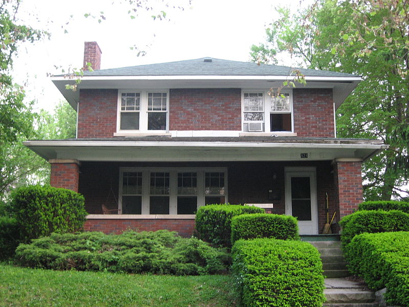
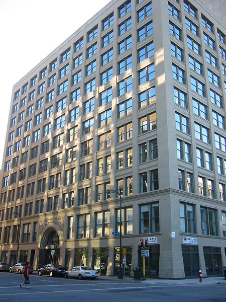
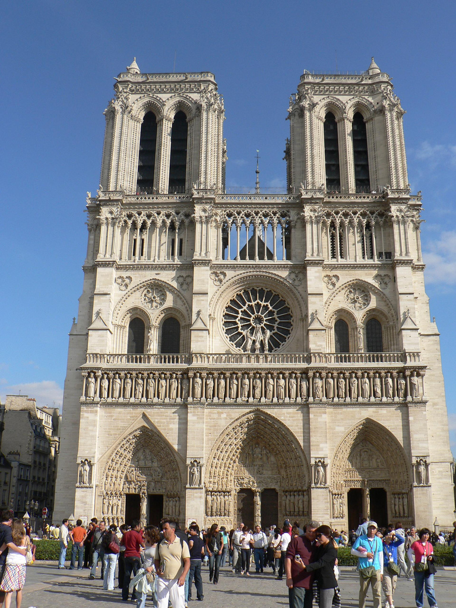

# Generative AI: Empowering Creatives with Specialized Image and Language Models

I'll cut to the chase. Generative AI is cool but no, I don't think it's going destroy humanity.

I wanted to find some interesting applications of generative AI for my independent study in Cognitive Science @ Dartmouth College. Formally, my focus  area is "How can understanding the brain help us build better tools?" I have learned that Generative AI is a powerful application of brain-based software that affords incredible opportunities for creating tools that improve the human experience. Whether it's neurons or nodes, the emergent properties resulting from millions of finetuned dials never ceases to amaze me.

## Table of Contents

1. [Outputs](#outputs)  
1-1. [Text-Guided Image-to-Image Generation for Modern Architecture Design](##text-guided-image-to-image-generation-for-modern-architecture-design)  
1-2. [Masked Language Models for Personalized Autocompletion](##masked-language-models-for-personalized-autocompletion)  
2. [Training](#training)  
2-1. [Data](###data)  
2-2. [Computing](###computing)  
2-3. [Models](###models)  
3. [Intermediary Models](#intermediary-models)  
4. [Works Cited](#works-cited)  
5. [Next Steps](#next-steps)  

# Outputs

My best findings comprise the following tools. I cast a wide net into the pool of generative AI and only pursued what I perceived to be the most promising routes. Generative image and language tools have seen remarkable growth over the past couple years and are now open-source, generalizable, and customizable. Check out what I was able to create below.

## Text-Guided Image-to-Image Generation for Modern Architecture Design

    
    

    <em>Prompt = "modern house with a spacious home office, featuring large windows, a sleek desk setup, and plenty of natural light to inspire productivity"</em>

This text-guided image-to-image model takes as input a prompt and an image and returns an ammended version of the image based on the prompt. The model is built on top of [Stable Diffusion 2-1](https://huggingface.co/stabilityai/stable-diffusion-2-1-base) and finetuned for 75 epochs on a [custom web-scraped modern architecture dataset](https://huggingface.co/datasets/benlehrburger/modern-architecture). My vision for this model was to serve as the foundations of a tool to assist architects and designers in thinking outside of any box they may be confined to.

    
    

    <em>Prompt = "office building designed for sustainability, incorporating features like solar panels, rainwater harvesting systems, and efficient insulation to minimize environmental impact"</em>

To be a fully deployable tool, the model should be further finetuned on organic architecture (think [Zaha Hadid](https://www.zaha-hadid.com/)). Right now it produces a lot of "classically" modern results that are not as outlandish as the [Parametricism Era](https://en.wikipedia.org/wiki/Parametricism) of architecture – based on CAD modeling and algorithmic design – permits. It also suffers from the classic image generation pitfall of warping and bending reality when you take a closer look. However, it is an interesting first step towards new architectural possibilities.

    
    

    <em>Prompt = "modern church that pays homage to its religious symbolism through carefully crafted contemporary stained glass windows, capturing the play of light and color"</em>

Yes, those prompts were generated with ChatGPT. I'm really leaning into this whole thing.

## Masked Language Models for Personalized Autocompletion

I trained a masked language model to autocomplete my next word based on my undergraduate writings. The vision is something like a personalized [Grammarly](https://www.grammarly.com/) but with control over your data. I compiled a [training corpus](https://huggingface.co/datasets/benlehrburger/college-text-corpus) of over 3000 lines of writing samples from essays I had written during my time in college, which I used to finetune [DistilBERT](https://huggingface.co/distilbert-base-uncased) for 50 epochs. The "masked" in masked language model represents the word to be predicted, like so:

>Cognitive [MASK] >>> cognitive neuroscience

The model does well at predicting words in a coherent way.

>I'm looking for [MASK] >>> i'm looking for answers  
>I believe in [MASK] >>> i believe in truth

But it doesn't exactly understand who I am.

>I go to school in [MASK] >>> i go to school in bangkok  
>Ben [MASK] >>> ben!

I think if I were to give the tool more of a capacity for "long-term memory" moving forwards and consistently train it, it would really start to become a helpful, personalized writing aide. But right now it's just kind of weirdly pessimistic:

>One day we will [MASK] >>> one day we will die

# Training

### Data

### Computing

### Models

# Intermediary Models

# Works Cited

# Next Steps

